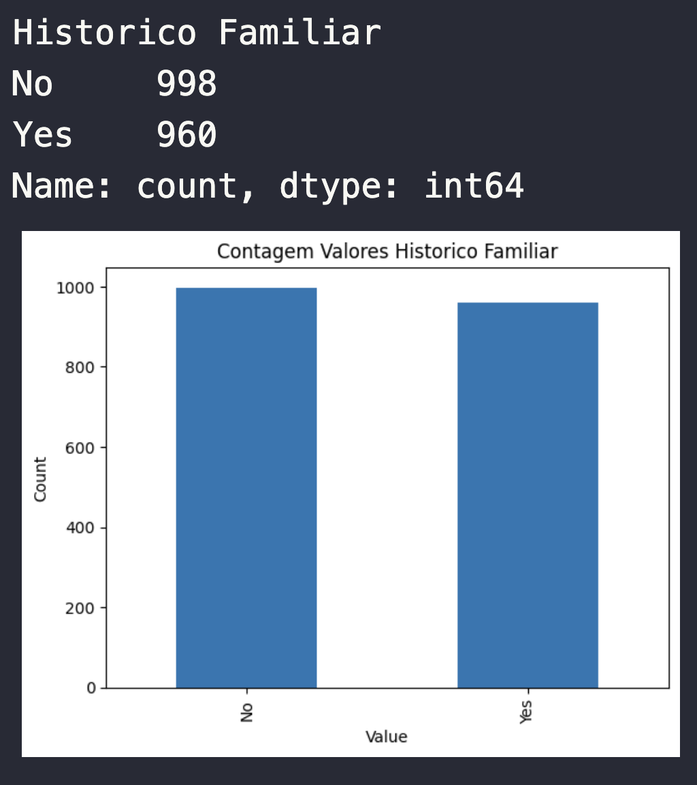

Estudo sobre Osteoporose. O conjunto de dados oferece informações abrangentes sobre os fatores de saúde que influenciam o desenvolvimento da osteoporose, incluindo detalhes demográficos, escolhas de estilo de vida, histórico médico e indicadores de saúde óssea. O objetivo é facilitar a pesquisa na previsão da osteoporose, permitindo que modelos de aprendizado de máquina identifiquem indivíduos em risco. A análise de fatores como idade, sexo, alterações hormonais e hábitos de vida pode ajudar a melhorar o manejo da osteoporose e as estratégias de prevenção.

### Sobre a Base de Dados e os Dados fornecidos para estudo
Na base de Dados os Dados informados estão bem equiparados

- Genero: Female e Male pouca diferença entre a quantidade de cada caso de genero informado na Base de Dados

- Mudanças hormonais: Normal e Postmenopausal há pouca diferença entre a quantidade de cada caso de Mudanças hormonais informados na Base de Dados

- Historico Familiar: No e Yes de casos que tenham Historico Familiar há pouca diferença entre a quantidade de cada caso de Historico Familiar como yes e no informados na Base de Dados

- Raça/Etnia: há três etnias nos casos informados, sendo African *American*, *Caucasian* e *Asian* e entre os casos com as três etnias, há pouca diferença entre a quantidade de cada caso de Etnia informados na Base de Dados

- Peso Corporal: Normal e Underweight de casos para informar o peso corporal há pouca diferença entre a quantidade de cada caso de Peso Corporal com Normal e Underweight informafos na Base de Dados.

- Ingestão de Calcio: Low e Adequate de casos informando a ingestao de calcio há pouca diferença entre a quantidade de cada caso de Ingestão de Calcio.

- Ingestão de Vitamina D: Sufficient e Insufficient de casos informando a ingestao de Vitamina D há pouca diferença entre a quantidade de cada caso Sufficient e Insufficient de Ingestão de Vitamina D.

- Atividade Fisica: Active e Sedentary de casos informando de Atividade Fisica há pouca diferença entre a quantidade de cada caso de Active e Sedentary de praticante de Atividade Fisica.

- Fuma: Yes e No de casos informando de Fumantes há pouca diferença entre a quantidade de cada caso de quem yes fuma e No Fuma.

- Consome Bebida Alcoolica: Yes e No de casos informado de quem Ingere Bebida Alcoolica há pouca diferença entre a quantidade de cada caso de quem No Ingere Bebida Alcoolica e Moderate Ingere Bebida Alcoolica.

- Condicao Medica: Hyperthyroidism, Rheumatoid Arthritis e No de casos informados das condicoes medicas há pouca diferença entre as quantidade de quem tem Hyperthyroidism, Rheumatoid Arthritis e No na base de Dados.

- Medicacao: Corticosteroids e No de casos informados de quem toma medicação ou não há pouca diferença entre as quantidade de quem utiliza Corticosteroids e No na Base de Dados.

- Fraturas Previas: Yes e No de casos informados de quem tem fraturas previas ou nao, há pouca diferenca entre as quantidade de quem Yes e No Fraturas Previas.

Conforme podemos verificar nas colunas da base de Dados, podemos aferir que todos os casos inseridos não há diferenças abruptas entre um dado e outro.

Porém, ao verificar a coluna idade vemos desproporção muito grande até os 40 anos

Nesse Caso, não há necessidade em popularmos ou deletarmos dados para que o estudo fique mais equiparado (afinal, para haver comparação deve-se ser justo =D ).

### O que podemos aferir com a Base de Dados